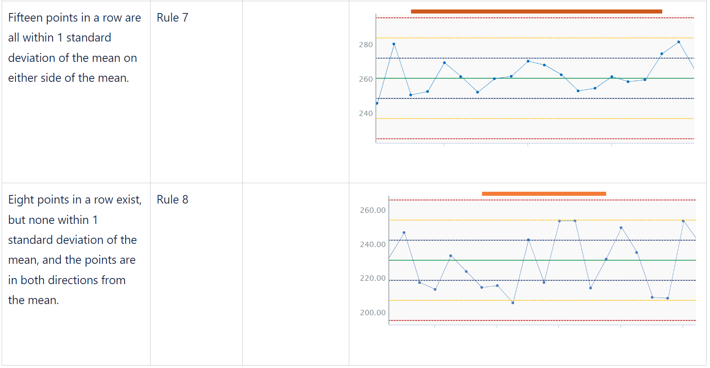

# User Guide

# 1.0 Overview

The SPC Accelerator Add-on enables users to quickly and easily build SPC charts with Western Electric or Nelson Run Rule Conditions. 

The SPC Chart created with the Add-on is a simple implementation of an Individuals Chart, or I-Chart in Seeq, using the standard deviation (not the average of moving range) to construct the +/- sigma limits. 

# 2.0 Installation

The SPC Accelerator Add-on is available to be installed and updated using the Add-on Manager on the Seeq homescreen. If the SPC Accelerator Add-on does not appear in the Add-on Manager, contact your Seeq account team. 

# 3.0 How to Use the Add-on

1. Identify the Control Chart input signal and add to the worksheet trend. (Optional) Create conditions or conditions with properties to use as inputs to the SPC Accelerator Add-on Tool.
2. Open the SPC Accelerator Add-on Tool.
3. Select the input signal. 
4. Define the maximum signal interpolation. The default is 40 hours.
5. Select the Training Window and Conditions Filters. The combination used is dependent on the specific use case. Here are a couple of variations: 
    - **Choose only a Training Window.** This will calculate control limits based on the signal data within the training window
    - **Choose a Training Window and a Condition Filter.** This will calculate the control limits based on the the data within the condition that is within the training window. The condition used for the Condition Filter and the Apply To Condition can be the same condition or different conditions.
    - **Choose a Training Window and a Condition Filter with capsule properties.** This will calculate the control limits based on the the data within the condition that is within the training window, and it will create unique limits based on the unique property. For example, if there are multiple grade codes requiring separate control limits for the input signal, a condition with properties specifying the grade code can be used as an input to the SPC Accelerator. To input a condition with properties, use the Optional fields (Condition Filter and Spearate By Capsule Property), inputting the Condition Filter and the capsule property used to separate the data. Then, input a Training Window, when using properties, make sure the Training Window includes capsules from all desired properteis. The condition used for the Condition Filter and the Apply To Condition can be the same condition or different conditions, however, if capsule properties are used, the capsule properties must match to apply control limits correctly.
6. If a Condition Filter was chosen, choose the 'Apply to Condition.' This may be the same condition selected above, or a different condition.
7. Select the additional desired outputs: Control Chart, Western Electric Run Rules, Nelson Run Rules, Histogram Normality Check.

### 3.3 SPC Accelerator Output

Once all of the selections are made and the add-on is executed, it will create new worksheets for each signal and output selection. For example, if an input signal and Control Chart and Nelson Run Rules are selected, a worksheet will be created for the control chart, containing a control chart, and a worksheet will be created for the Neson Run Rules, containing a control and the Nelson Run Rules conditions. 

### 3.3 Supplemental Run Rules Information

See the table for information on the run rule conditions created using the SPC Accelerator Add-on.

Run Rules with Seeq Screenshots:

